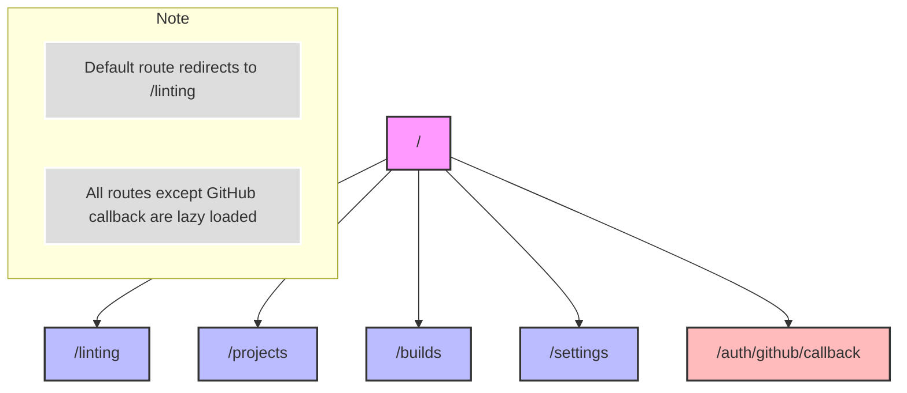

# Navigation Structure

This diagram shows the main navigation structure of the Sentinel application. Here are the key points:

1. Root Route (`/`)

   - Redirects to `/linting` by default

2. Main Routes:

   - `/linting` - Lazy loaded from @sentinel/linting
   - `/projects` - Lazy loaded from @sentinel/projects
   - `/builds` - Lazy loaded from @sentinel/build
   - `/settings` - Lazy loaded from @sentinel/settings

3. Authentication:
   - `/auth/github/callback` - Handles GitHub OAuth callback

Note: All main feature routes (linting, projects, builds, settings) are lazy loaded for better initial load performance.
